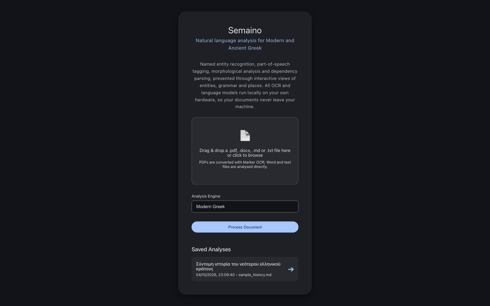
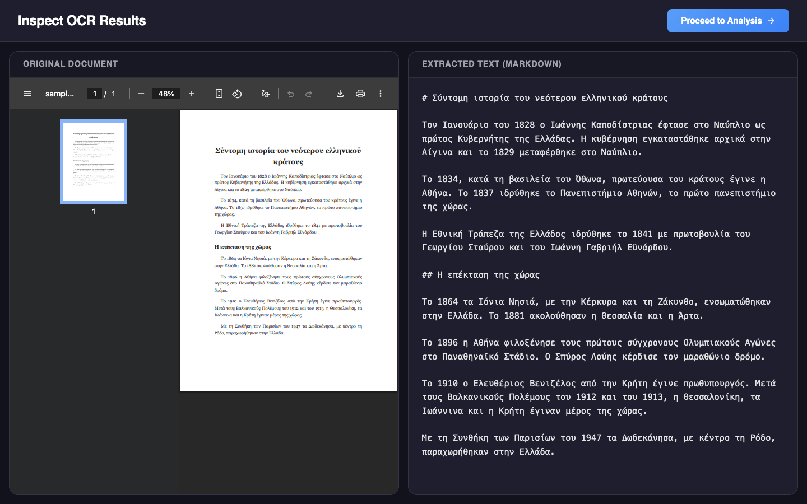
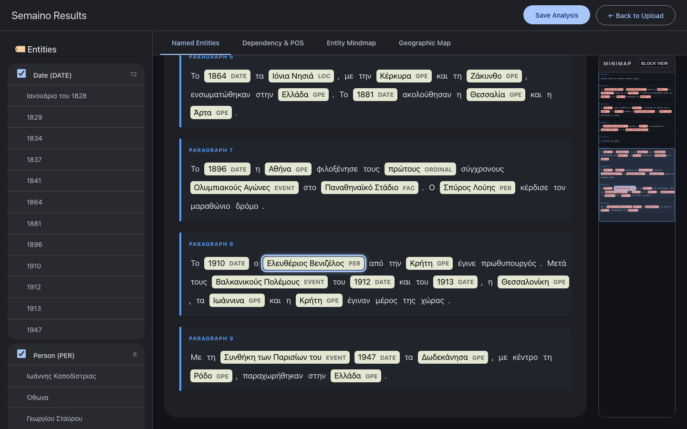
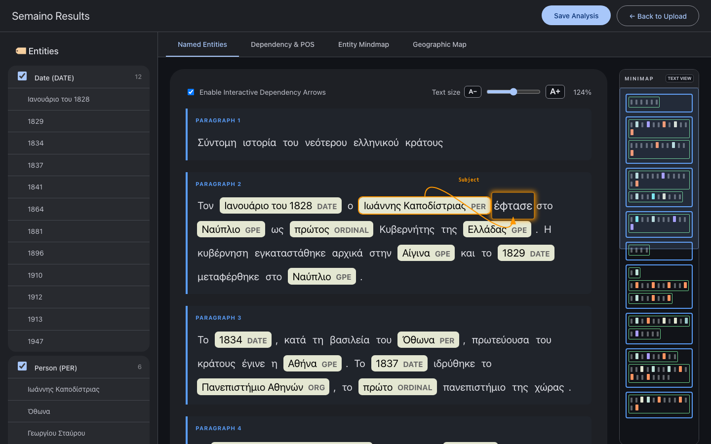
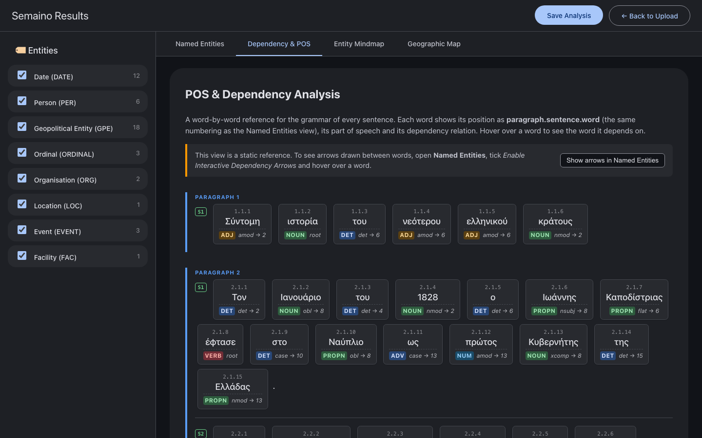
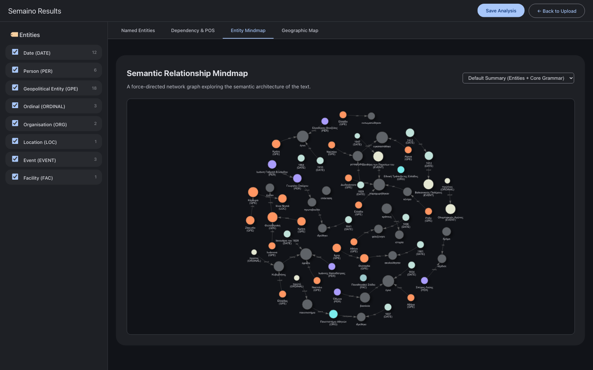
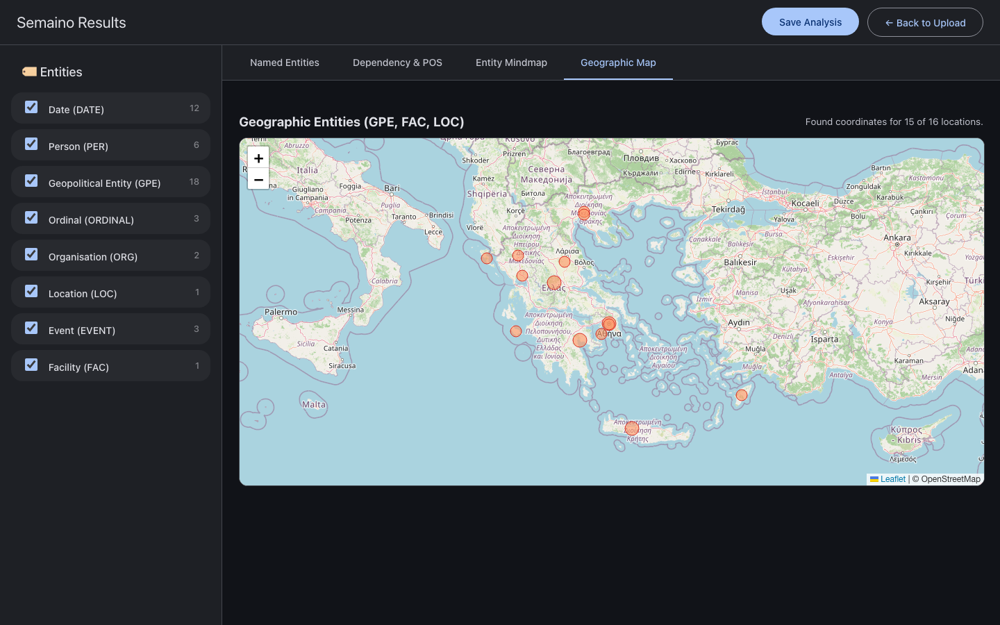

# Semaino: User Guide

Welcome to **Semaino**, a powerful web application designed for deep Natural Language Processing (NLP) of Greek texts. 

> **Local and private by design**
>
> All OCR and language models run on your own computer. No documents or text are sent to cloud services, external AI APIs or telemetry services, and once the models are installed Semaino works without an internet connection. The only exception is the optional Geographic Map (see [section 4D](#d-geographic-map)), which asks before contacting OpenStreetMap and can be removed entirely with `semaino serve --offline-map`.

This guide will walk you through how to use the interface, choose the right models, and interpret your results. The screenshots use the generic sample text [`examples/sample_history.md`](../examples/sample_history.md), which you can analyse yourself to follow along.

---

## 1. Getting Started: Uploading a Document

Start Semaino with `semaino serve` and open `http://127.0.0.1:5001` in your browser. You will be greeted by the main upload screen.

You can upload three kinds of file (drag and drop onto the dashed area, or click it to browse):
1. **A PDF (`.pdf`)**: Best for scanned documents, books, or official papers. Semaino uses a state-of-the-art vision model (Marker) to read the PDF and convert it into text while preserving the layout. This requires Marker to be installed (see the README).
2. **A Word document (`.docx`)**: The text is read directly from the file, so there is no OCR step. Each paragraph stays a separate paragraph and each table row becomes one line, with its cells separated by semicolons. Automatic list numbering and bullets, headers, footers, footnotes, comments and text boxes are not imported. The older `.doc` format is not supported: open the file in Word (or LibreOffice) and save it as `.docx` first.
3. **A Markdown or text file (`.md`, `.txt`)**: Best if you already have digitised text. This also skips the OCR step and goes straight to analysis. Text files must be UTF-8 encoded.

Choose the **Analysis Engine** (see [section 3](#3-choosing-the-right-nlp-engine)) and click **Process Document**. A progress bar shows how many sentences have been analysed. The first analysis after starting Semaino takes longer, because the models are loaded into memory.

Your previously saved work is listed under **Saved Analyses** at the bottom of the screen (see [section 5](#5-saving-and-loading-sessions)).

---

## 2. The OCR Inspection Step (PDFs Only)

If you upload a PDF, the system will begin the **OCR (Optical Character Recognition)** process. Because this relies on AI vision models, it may take a moment depending on the length of the document and your hardware.

Once complete, you will be taken to the **Inspection Screen**:

- **Left Side**: Displays your original PDF.
- **Right Side**: Displays the extracted text (Markdown) exactly as Marker produced it.
- **Why?** OCR is never 100% perfect. This screen allows you to review the extracted text and fix any typos, missed words, or formatting errors before sending it to the NLP engine. 
- Once you are satisfied with the text, click **"Proceed to Analysis"**.

> **Automatic clean-up.** You do not need to remove Markdown or HTML left over from OCR yourself. Before analysis, Semaino strips heading marks (`#`), footnote numbers (`1`), image links, emphasis markers (`*`, `**`), quote and list markers, table borders and other HTML tags, and converts LaTeX-encoded Greek letters back into text. Ordinals such as `6ος` become `6ος`. The inspection screen still shows the raw OCR output, so you can see exactly what Marker produced.

---

## 3. Choosing the Right NLP Engine

Before analysing your text, select an engine from the **Analysis Engine** menu. Choosing the right engine is critical for accurate results:

* **Modern Greek (Innovative Custom Pipeline)**: 
  * *Best for:* Most Greek texts from the 19th century to today, including legal documents, news, and everyday language.
  * *Under the hood:* This is a major innovation of the Semaino platform. While many widely used NLP toolkits (including spaCy) currently lack native transformer-level models for Modern Greek, this custom pipeline bridges that industry-wide gap. It combines a state-of-the-art open-source BERT transformer (via `gr-nlp-toolkit`) for deep-learning accuracy in NER and POS tagging, perfectly integrated with the structural integrity and production-grade architecture of the **spaCy** ecosystem (OdyCy is used to split the text into sentences). The BERT model works on lower-case, unaccented text; Semaino maps every word back to your original text, so the results show the original capitalisation and accents, including polytonic ones.
* **Ancient Greek**: 
  * *Best for:* Ancient Greek, Katharevousa, or highly polytonic texts. 
  * *Under the hood:* Uses the OdyCy transformer model (`grc_odycy_joint_trf`) for syntax and the UGARIT BERT model specifically trained to recognise ancient entities (like historical figures and ancient cities).

With both engines, **a blank line always ends a sentence**. Headings and paragraphs in your document therefore stay separate in the results, and the paragraph numbers you see match the paragraphs of your file.

---

## 4. Understanding the Results Interface

Once the analysis is complete, you will enter the **Semaino Results** workspace. On the left is the **Entities** sidebar; across the top are the result views: **Named Entities**, **Dependency & POS**, **Entity Mindmap** and **Geographic Map**.

### A. Named Entities

This is the default view, and it highlights specific entities in your text, such as **Person (PER)**, **Organisation (ORG)**, **Geopolitical Entity (GPE)**, **Location (LOC)**, **Facility (FAC)**, **Event (EVENT)** and **Date (DATE)**. Each paragraph is numbered.

* **Strict Deterministic NLP vs. LLMs**: Unlike Generative LLMs (which often hallucinate character offsets or fail to map entities to exact token indices due to their subword tokenisation architecture), Semaino relies on deterministic NLP models (**gr-nlp-toolkit**, **OdyCy**, **spaCy**). When an entity is found, Semaino knows its *exact* paragraph, sentence, and word position.
* **Clickable Navigation**: Open a category in the sidebar and click any entity. The text scrolls to that exact occurrence and highlights it, both in the text and in the minimap. Clicking an entity while another view is open brings you back to this view.
* **Category Filters**: Untick a category's checkbox in the sidebar to hide its highlighting in the text and in the minimap; tick it again to bring it back.
* **Text Size**: Use **A−** / **A+** or the slider at the top right of the view to make the text smaller or larger (76%–171% of the normal size). The minimap follows, your reading position is kept, and your choice is remembered in this browser.
* **Document Minimap**: On the far right is a scaled copy of the whole document. The highlighted box shows which part is on screen and moves as you scroll; click anywhere on the minimap to jump there. The **BLOCK VIEW** / **TEXT VIEW** button switches between the miniature text and a block view in which every word is a small block (entities in their category colour, grouped by paragraph and sentence). Hover over a block to highlight that word in the text.

#### Interactive Dependency Arrows

Tick **Enable Interactive Dependency Arrows** at the top of the view, then hover over any word. Semaino draws an arrow from the word to the word it depends on, labelled with the grammatical relation (for example *Subject*, *Object* or *Case / Preposition*). Arrows pointing to an entity are drawn in red.

### B. Dependency & POS

This view is a **static, word-by-word reference** for the grammar of every sentence, laid out by paragraph and sentence. The arrows themselves are drawn in the Named Entities view: use the **Show arrows in Named Entities** button at the top of this view to go there with the arrows switched on.

Each word card shows:
- **Its position**, written as **paragraph.sentence.word**. For example, `2.1.10` is the 10th word of the 1st sentence of paragraph 2. Paragraph numbers are the same as in the Named Entities view, and each sentence is labelled `S1`, `S2`, … within its paragraph. Punctuation counts towards the word numbers but has no card of its own.
- **POS (Part of Speech)**: whether the word is a noun (`NOUN`), proper noun (`PROPN`), verb (`VERB`), adjective (`ADJ`), determiner (`DET`), and so on.
- **Dependency relation**: the word's grammatical role, followed by the number of the word it depends on in the same sentence. For example, `nsubj → 8` means "subject of word 8". The main word of the sentence is marked `root`.

Hover over a card to see its full position and the word it depends on.

### C. Entity Mindmap

A force-directed network graph of the text. Entities (coloured by category) and key words (grey) are connected according to their grammatical relations. Drag nodes to rearrange the graph, scroll to zoom, and use the menu at the top right to switch between the default summary, entities only, entities with their direct neighbours, or core grammar only.

### D. Geographic Map

If your text contains spatial entities (geopolitical entities, locations and facilities), this tab plots them on an interactive map. The status line above the map reports how many places were found.

*Note: Because mapping requires resolving place names to coordinates, this tab asks for your permission before querying OpenStreetMap: the place names are sent for geocoding and the map tiles are downloaded from OpenStreetMap; the rest of your text is never sent. If Semaino is started with `semaino serve --offline-map`, the tab is removed and no external requests are ever made.*

---

## 5. Saving and Loading Sessions

NLP processing takes time and computational power. If you analyse a long document, you don't want to have to wait for the AI to process it again tomorrow!

- **Saving**: In the top right corner of the Results screen, click **"Save Analysis"**. Give your session a memorable name. This saves all the processed data to a local file (in `~/.semaino/saved_analyses` unless you started Semaino with `--data-dir`).
- **Loading**: On the main upload screen, scroll down to the **"Saved Analyses"** section. Clicking an entry instantly loads the results, without running the models again.

> A saved analysis keeps the results it was created with. After upgrading Semaino, analyse the document again to benefit from improvements such as the OCR clean-up and paragraph handling.
